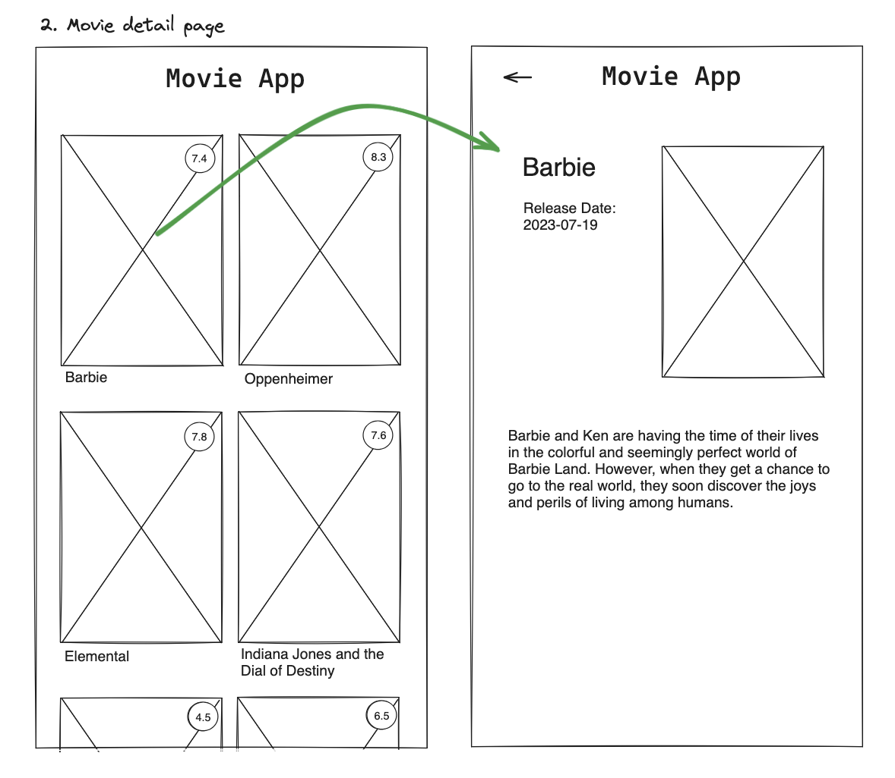

# Title

## Value Proposition

**As a** `movie app user`  
**I want to** `click on a movie and see details about the movie`  
**so that** `I can decide based on the description and release date to watch it`  

## Description

## Acceptance Criteria
 - When the user selects a movie from the list on the homepage, they are directed to a dedicated movie detail page
 - On the movie details page, the user sees the following information:
 - The movie's poster
 - The movie's title
 -The movie's release date
- An informative description of the movie, providing insights into its plot
 - The user can return to the homepage by clicking a dedicated - "Back to Home" button located on the top of the movie details page

## Tasks
 - Create the feature branch movie-details-page
-  Create the movie details page pages/movies/[id].js
 - Render the movie’s poster, title, release date and - description
 - Add the Link component to navigate back to the homepage
 - Update the Movie component
 - Add the Link component to navigate to the details page
 
